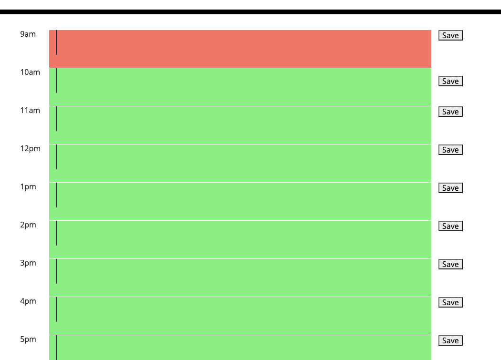
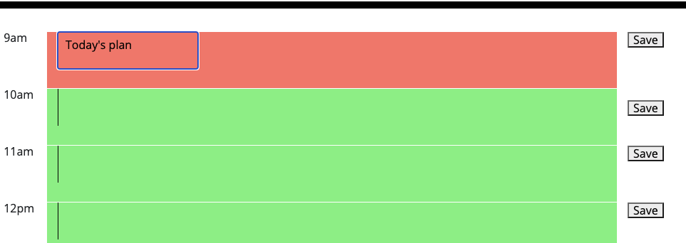
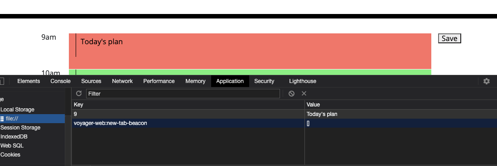
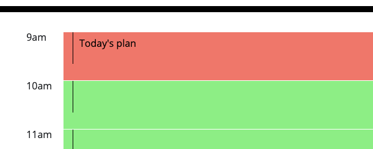

# Schedule_Your_day
BCS_Homework week 5
I have made a day schedule using javascript DOM and Jquery

## Criteria
 * WHEN I open the planner
 * THEN the current day is displayed at the top of the calendar

 * WHEN I scroll down
 * THEN I am presented with time blocks for standard business hours
 * THEN each time block is color-coded to indicate whether it is in the past, present, or future
 

 * WHEN I click into a time block 
 * THEN I can enter an event
  

 * WHEN I click the save button for that time block
 * THEN the text for that event is saved in local storage
 
 * WHEN I refresh the page
 * THEN the saved events persist
 

# What I learned from this homework
 * This homework made me feel much better than the last one to be honest. I have made conteiner,row and col div in html first. Then creat elements in Javascript to append to it. I wondered if I was supposed to create the divs in Javascript as well when I was submitting this. But I did not having enough time to fix it. I just submit as it is. Functions are all working in order, and I know what I need to change. 
 Jquery is little confusing me still, but also making it much easier to write a  code in js file. SO amazing!